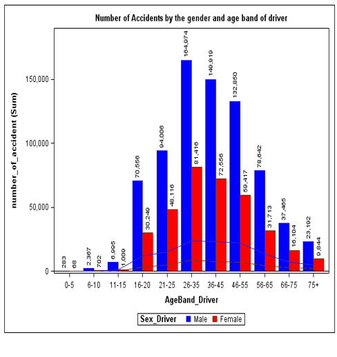
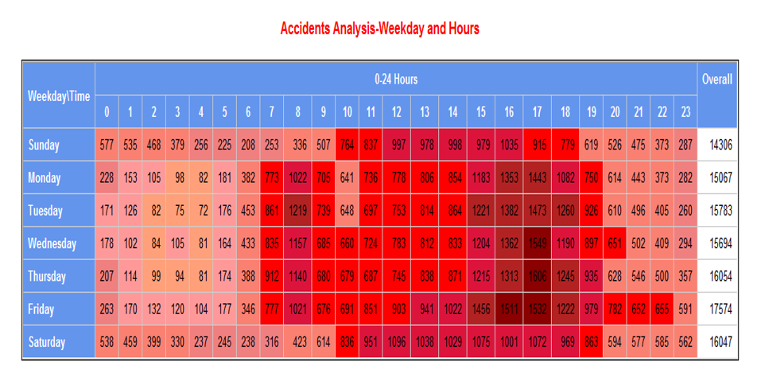

# Killed-or-Seriously-Injured-KSI-Modeling-Analysis-
Automate modelling process with SAS/SQL

This project analyzes UK car accidents from 2005 to 2015 by using various visulization tools (e.g. line, pie, bar plots etc.) and predict modelling.

# Data
[https://www.kaggle.com/datasets/stefanoleone992/fifa-22-complete-player-dataset](https://www.kaggle.com/datasets/silicon99/dft-accident-data)

## Data Hierarchy
Accident - Vehicle - Casualty

## Data structure
This project analyzed three provided CSV files 
Accident: 1,780,653 records and 32 variables
Vehicle: 3,262,270 records and 22 variables
Casualty: 2,402,909 records and 15 variables  

This project focus on the car collisions from the year 2011 to 2015.

# Result Display (Data Visualization)

## Showcase accident numbers by gender and age band of drivers
This bar plot shows that males aged 26–35 experienced the highest number of car accidents. 

Male drivers consistently have a significantly higher number of accidents across all age groups compared to female drivers, indicating a possible gender-related risk factor in driving behavior.

The number of accidents peaks for both genders in the 26–35 age group, suggesting this age band might represent a critical period of driving risk, potentially due to factors like higher driving exposure or risk-taking behavior.

* Key Tools Used: Proc Sgplot

## Showcase accident numbers by weekdays and time

This heatmap provides a clear visual representation of the relationship between weekdays, time of day, and the frequency of car accidents.

* Peak Accident Hours

The highest number of car accidents occurred between 15:00 and 18:00 throughout the week, likely corresponding to evening rush hours when traffic is denser.

* Weekday Trends
  
From Monday to Friday, there was a consistently high number of car accidents, reflecting regular weekday traffic patterns, possibly due to commuting.

* Weekend Differences

On Saturday, accidents remained relatively high, but the distribution was slightly different, with elevated numbers between 12:00 and 18:00, suggesting leisure-related traffic.
On Sunday, the number of accidents was lower overall compared to weekdays but still peaked around 12:00 to 18:00.

* Key Tools Used: Proc Tabulate

# Result Display (Predictive model of KSI)
Killed or Seriously Injured (KSI) is a standard metric for safety policy, particularly in transportation and road safety. (Wikipedia)

Objective: create a model to predict severity of car accident, whether is slight or severe(or fatal) based on various information, such as weather, light condition, etc.

Tables used to build this model: Accident, Vehicle

Important to know: 
* Lots of categorical variables and lack of numeric variables
* Transforming variable Engine Capacity to log 
  
  
* Collapsing categorical variable which has lots of value and in which the distribution of value is largely different (e.g. var Vehicle Manoeuvre)
  
  

* Pormula: ( Intercept )*-3.1432 + ( Age_of_Driver )*0.00880 + ( Age_of_Vehicle )*0.00549 + ( Day_of_Week='1')*0.1175 + (Day_of_Week='2' )*-0.0412 + ( Day_of_Week='3' )*-0.0475 + ( Day_of_Week='4' )*-0.0365+ ( Day_of_Week='5' )*-0.0408 + ( Day_of_Week='6' )*-0.0311 + ( Driver_Home_Area_Type='-1')*-0.1171 + ( Driver_Home_Area_Type='2' )*0.0381 + ( JD_clus_1 )*-0.0370 + ( JL_clus_4 )*0.2408 +( JL_clus_5 )*0.2978 + ( Junction_Control='-1' )*0.1371 + (Light_Conditions='1' )*-0.1081 + (Light_Conditions='4' )*0.0497 + ( Light_Conditions='5' )*0.0787 + ( Light_Conditions='6' )*0.0726+ ( Location_Easting_OSGR )*-4.41E-7 + ( Location_Northing_OSGR )*2.868E-7 + (Road_Surface_Conditions='1' )*0.3303 + ( Road_Surface_Conditions='2' )*0.2465 + (Road_Surface_Conditions='3' )*-0.3332 + ( Road_Surface_Conditions='4' )*-0.1659 + ( Road_Type='1')*-0.1711 + ( Road_Type='2' )*0.2103 + ( Road_Type='6' )*0.2509 + ( Road_Type='7' )*-0.1993 + (Sex_of_Driver='2' )*-0.2608 + ( Skidding_and_Overturning='1' )*0.1313 + (Special_Conditions_at_Site='0' )*0.1316 + ( Special_Conditions_at_Site='4' )*-0.0959 + (Special_Conditions_at_Site='5' )*0.3217 + ( Special_Conditions_at_Site='6' )*0.2828 + (Speed_limit )*0.0133 + ( Urban_or_Rural_Area='1' )*-0.0956 + ( VM_clus_1 )*-0.3677 + ( VM_clus_2)*-0.1259 + ( VM_clus_3 )*-0.0513 + ( VM_clus_4 )*-0.4959 + ( VM_clus_5 )*-0.7675 + ( VM_clus_7)*-0.0747 + ( VM_clus_8 )*0.0994 + ( VM_clus_9 )*-0.8430 + ( VT_clus_1 )*0.4694 + ( VT_clus_2)*0.8351 + ( VT_clus_5 )*0.5900 + ( VT_clus_6 )*0.1774 + ( Vehicle_Leaving_Carriageway='0')*-0.2422 + ( Vehicle_Leaving_Carriageway='2' )*-0.0753 + (Vehicle_Leaving_Carriageway='3')*0.2841 + ( Vehicle_Leaving_Carriageway='4' )*-0.1540 + ( Vehicle_Leaving_Carriageway='5')*-0.2965 + (Vehicle_Leaving_Carriageway='6' )*0.4183 + (Vehicle_Leaving_Carriageway='7')*0.0609 + ( Weather_Conditions='1' )*0.1483 + ( Weather_Conditions='4' )*0.1375 + (Weather_Conditions='5' )*-0.0789 + ( Weather_Conditions='7' )*0.1802 + ( _1st_Point_of_Impact='0')*0.2451 + (_1st_Point_of_Impact='1' )*0.0755 + ( _1st_Point_of_Impact='2' )*-0.4380 + (_1st_Point_of_Impact='3' )*0.0764 + ( _1st_Road_Class='1' )*-0.2785 + ( _1st_Road_Class='2')*-0.2613 + ( _1st_Road_Class='3' )*0.1689 + ( _1st_Road_Class='4' )*0.2032 + (_1st_Road_Class='5' )*0.0393 + ( _2nd_Road_Class='-1' )*0.2556 +(_2nd_Road_Class='3' )*-0.1416 +( ped_cross_phy_fac='0' )*-0.1247 + ( ped_cross_phy_fac='1' )*-0.0932 + ( ped_cross_phy_fac='4')*0.0691 + ( time_band='10:00-15:00' )*-0.0549 + ( time_band='8:00-10:00' )*-0.1701 + (time_band='after18:00' )*0.0609

## Model building process
Objective: predict the probability of getting severe car accident.

1. Understand raw data
   * Import CSV files into SAS
   * Investigate data with PROC FREQ, PROC UNIVARIATE, PROC MEANS
2. Data Cleansing
   * Select those car accident records only from 2011 to 2015
   * Delete records with "-1"
     
3. Data Manipulation with automation
   * Create macro variables: a variable listed all character variables and a variable listed all numeric variables
   * Derive new variables based on existing variables, for example time band
   * Generate missing indicator variables automatically with data step and macro
     
4. Modelling with PORC LOGISTICS
   * Split data into training dataset(70%) and validation dataset(30%)
   * Target variable: accident severity (consider value fatal and serious as 1, slight 0)
     
     Independent variables: Environmental factors (Driver Home Area Type, Road Surface Conditions, Light Conditions, etc.); Driver-related and car-related factors (such as Age of driver, Vehicle Manoeuvre);  Date and Time (Day of Week, Time band)
   * Automation: collapse the levels of categorical var based on its association with KSI
   * Numeric variable cluster using PROC VARCLUS to reduce variables in model 
   * Build logistic model using PROC LOGISTIC
   * Validate model
   * Plot model performance
     * Performance: ROC 0.679
  
  
     

